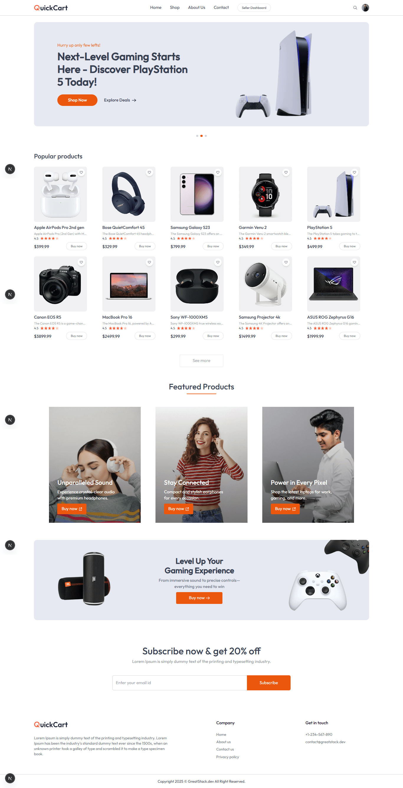
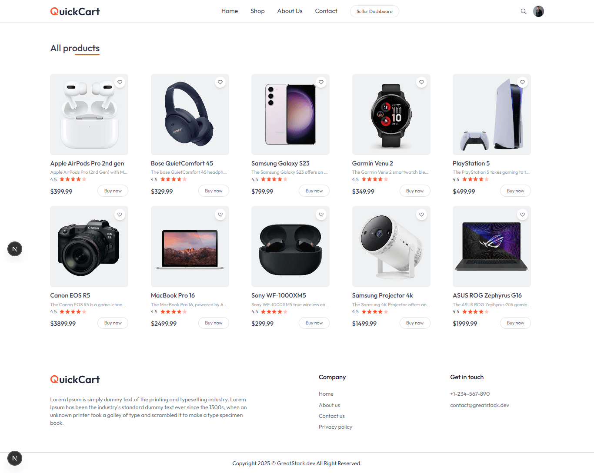
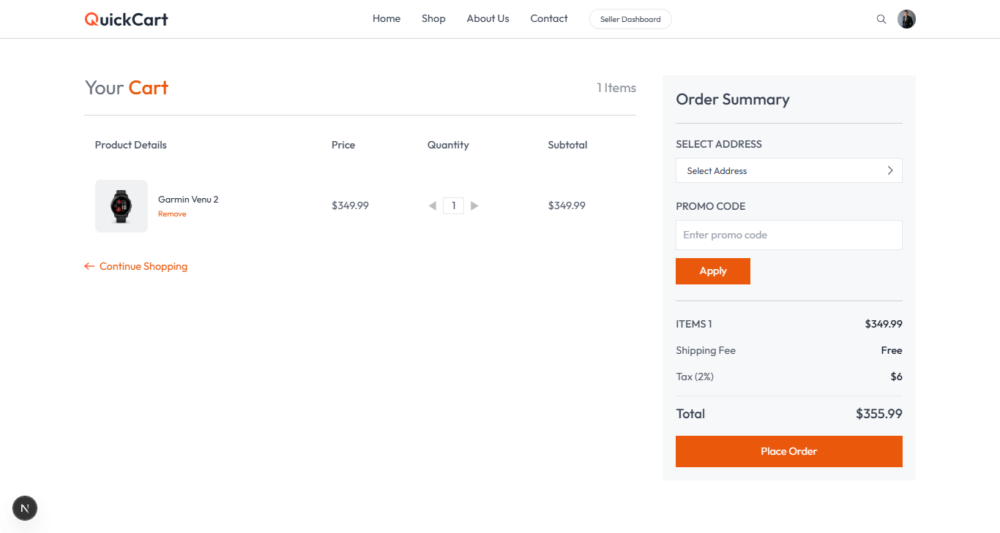

# 🛒 E-Commerce App - Next.js


## 📦 Tentang Proyek

**E-Commerce-Next-js** adalah aplikasi e-commerce modern yang dibangun menggunakan **Next.js**, **Tailwind CSS**, dan **TypeScript**, yang dirancang untuk memberikan pengalaman belanja yang cepat, responsif, dan dinamis. Aplikasi ini mendukung fitur belanja online seperti katalog produk, keranjang belanja, dan checkout.

---

## 🚀 Fitur Utama

- 🔍 Pencarian dan filter produk
- 🛒 Keranjang belanja dinamis
- 💳 Proses checkout
- 🖼️ Gambar produk responsif
- 🔄 Routing cepat dengan Next.js
- 🌙 Dukungan mode terang & gelap (opsional)

---

## 🧑‍💻 Teknologi yang Digunakan

- [Next.js](https://nextjs.org/) – Framework React untuk rendering sisi server & SPA
- [Tailwind CSS](https://tailwindcss.com/) – CSS Utility-first
- [TypeScript](https://www.typescriptlang.org/) – Superset dari JavaScript untuk pengetikan statis
- [React Icons](https://react-icons.github.io/react-icons/) – Ikon siap pakai

---

## 📷 Cuplikan Tampilan

| Home Page                            | Product Page                               | Cart Page                            |
| ------------------------------------ | ------------------------------------------ | ------------------------------------ |
|  |  |  |

> Letakkan gambar cuplikan di folder `public/screenshots` agar tampil di atas.

---

## ⚙️ Instalasi Lokal

```bash
# Clone repositori
git clone https://github.com/adidarma24/E-Commerce-Next-js.git
cd E-Commerce-Next-js

# Instal dependensi
npm install

# Jalankan proyek di localhost
npm run dev

📌 Catatan
Proyek ini masih dalam tahap pengembangan.

Kontribusi dan feedback sangat diapresiasi!

⭐ Beri Bintang
Jika kamu merasa proyek ini bermanfaat, jangan lupa beri ⭐ di GitHub!

📝 Lisensi
MIT License © 2025 Adi Dharma Putra

```
